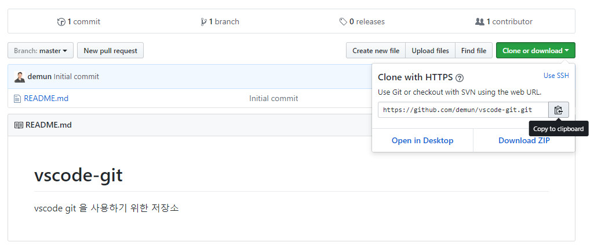
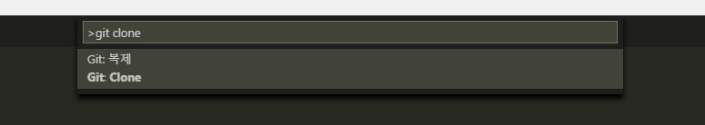
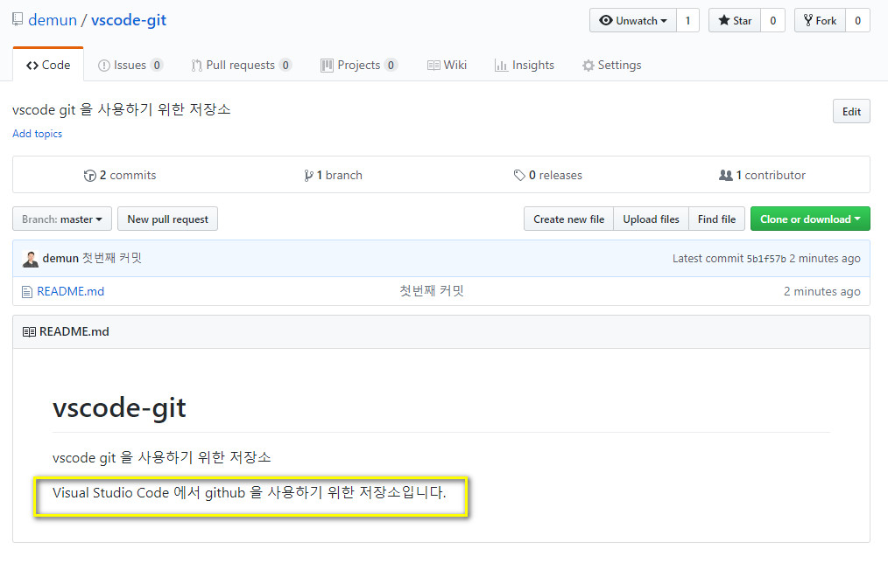
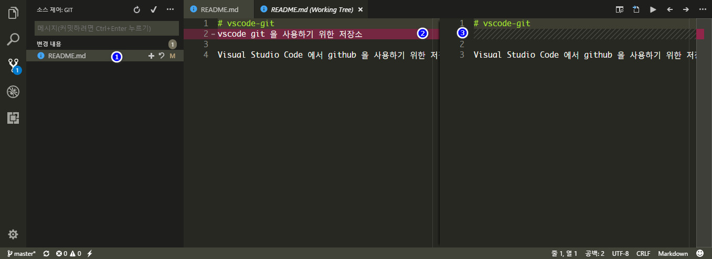

# git

vscode 는 git 을 사용하기 위한 기능이 기본적으로 추가되어 있습니다.

git 을 사용하려면 먼저 [https://github.com](https://github.com) 에 회원가입이 되어 있어야하고, [git-scm](https://git-scm.com/download/win) 에서 git 프로그램을 다운로드하고 설치해야 합니다.

가입이 안되어 있다면 [https://github.com](https://github.com) 에 회원가입을 하고 프로그램도 설치하시길 바랍니다.

설치가 되어 있다고 가정하고 vscode 에서 git 을 사용하는 방법을 알아보겠습니다.


## 최초설정

git 에 내이름과 이메일등을 먼저 등록하는 것이 좋습니다. vscode 에서 git 을 사용하다보면 나중에 이름과 이메일을 물어옵니다. 그러니 먼저 설정해둡니다.

이름과 이메일은 최초 한번만 설정하면 됩니다.

콘솔창을 열고 아래의 내용을 본인의 것으로 바꿔주세요. 

```console
git config --global user.name "이름" 
git config --global user.email "이메일"
```

## vscode 에서 git 사용하기

git 을 사용하려면 vscode 에서 지원하는 터미널에서 명령어를 입력해서 진행해도 똑같이 사용할 수 있습니다.

하지만 여기서는 그런 명령어없이 간단하게 클릭만으로 저장소를 사용하는 방법을 알려드립니다.

여기서는 테스트를 위해서 저장소를 생성하고 클론하는 방향으로 진행해보겠습니다. 저장소가 있는경우 클론부터 진행하면 됩니다.

먼저 저장소를 생성합니다.


vscode-git 이라는 저장소를 만들었습니다.


저장소 주소를 복사합니다.



`ctrl+shift+p` 를 눌러 명령팔렛트를 열어서 `git clone` 를 누릅니다.



저장소 주소를 물어오고, 복사한 주소를 넣습니다.


로컬컴퓨터의 위치를 물어오면 적당한 곳을 지정해줍니다. 


그럼 아래처럼 알림이 뜨고, 리포지토리 열기를 클릭합니다.


vscode 가 재시작되고 로컬의 저장소가 열립니다.


readme 파일을 수정해봅니다. 그럼 자동으로 git 부분에 수정한부분이 표시됩니다.


커밋 메시지를 적고, `ctrl+Enter` 을 눌러도 되고, 상단에 커밋아이콘을 클릭해도 됩니다.


알림창이 뜨고, 예 또는 항상을 클릭합니다.


이부분까지 하면 git 사이트에 커밋메시지가 보입니다.


상단에 메뉴부분을 클릭하면 확장메뉴가 나오는데 푸시를 클릭합니다.


이부분에서 위에서의 최초설정이 안되어 있으면 이름과 이메일을 물어옵니다.

하지만 설정을 했다면 바로 진행됩니다.

저장소에 보면 수정한 부분이 반영이 되어 있습니다.



지금은 수정사항이 없으니 커밋하고 푸시를 했지만, 여러번 반복하다보면 커밋 -> 풀 -> 푸시 순서로 해야합니다.

### 변경점 보기

수정된 파일을 클릭하면 수정된 부분을 볼 수 있습니다.

`1`번을 클릭하면 우측에 새로 파일이 나타나고, `2`, `3`번처럼 변경된 부분이 보입니다.




<br>