# 시작

비주얼 스튜디오 코드는 가볍고, 맥,리눅스,윈도우에서 모두 실행 가능하고, 무료인 코드편집기입니다.
Sublimetext, Atom 에디터의 장점들을 잘 모아 만든 에디터입니다. 특히 서브라임텍스트의 한글입력 문제,인코딩 문제를 깔끔히 해결한 에디터입니다.

다양한 언어를 지원하며, 확장 프로그램을 통해 에디터 기능을 확장시킬수 있습니다.

## 설치

[맥](https://code.visualstudio.com/docs/setup/mac), [리눅스](https://code.visualstudio.com/docs/setup/linux) 를 통해 설치를 할 수 있으며, 윈도우는 [인스트롤러](https://go.microsoft.com/fwlink/?LinkID=534107)를 통해 다운로드해서 설치를 진행할 수 있습니다.

> 윈도우는 .NET Framework 4.5.2 이상이 필요합니다.

!!! tip
    설치 프로그램에서 vscode를 %PATH% 에 추가하므로 콘솔에서 'code'를 입력해서 해당 폴더에서 vscode를 열 수 있습니다. %PATH% 환경 변수를 변경하려면 콘솔을 다시 시작해야 합니다.

vscode 는 설치시 자동으로 설치되는 확장기능이 있습니다. 그런 확장기능을 이용하려면 따로 설치해야하는 요소들이 있습니다.
git을 사용하려면 [git-scm](https://git-scm.com/download) 을 설치해야하고, 자바스크립트 등의 확장기능을 이용하려면 [nodejs](https://nodejs.org/) 를 설치해야하며, [TypeScript](https://typescriptlang.org/) 등을 설치해야합니다.

추가적으로 이용할 도구에 따라 Yeoman, Gulp, Bower 등등을 설치할수도 있습니다.

## 기초

vscode 를 실행하면 첫화면에 시작하기 하면이 나옵니다.


시작할때 마다 보일수도 있고, 왼쪽 하단에 체크를 풀면 안나오게 할 수도 있습니다.

우측 하단에 알아보기 > 대화형 실습에서 직접 코드를 실행하고 결과를 볼수 있는 놀이터도 있습니다.


## 명령팔레트

에디터의 모든 명령에 바로 접근할 수 있는 명령팔레트입니다.

단축키: `ctrl+shift+p`

또한 우측에 보면 기본단축키로 명령을 실행할 수도 있습니다.

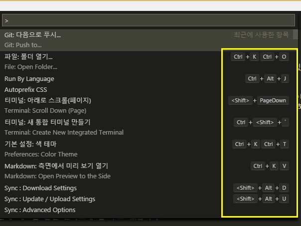

단축키에 대한 모든 명령은 [맥](https://go.microsoft.com/fwlink/?linkid=832143), [리눅스](https://go.microsoft.com/fwlink/?linkid=832144), [윈도우](https://go.microsoft.com/fwlink/?linkid=832145) 에 있습니다.

- `ctrl+p` : 파일이나 기호를 탐색합니다.
- `ctrl+shift+tab` : 마지막 연 파일에 접근합니다.
- `ctrl+shift+p` : 편집기 명령으로 바로 이동합니다.
- `ctrl+shift+o` : 파일의 특정 기호로 이동합니다.
- `ctrl+g` : 파일의 특정 행으로 이동합니다.

`ctrl+p` 를 눌러 `?` 를 입력하면 명령창에서 행할수 있는 명령 목록이 나옵니다.

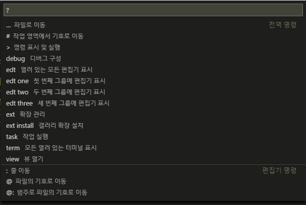


### 빠른열기

모든 파일을 단축키로 빠르게 열수 있습니다.

단축키: `ctrl+p`


### 상태표시줄

에디터 하단에 현재 상태를 표시하고 있습니다.

단축키: `ctrl+shift+m`

신속하게 프로젝트의 오류 및 경로로 이동합니다.


`F8` 또는 `shift+F8` 을 이용해서 오류 사이를 이동할 수 있습니다. 또는 키보드의 위아래 화살표로 이동이 가능합니다.


### 언어모드

파일형식에 맞는 언어모드로 자동으로 인식하지만 못할때는 단축키로 지정할 수 있습니다.

단축키: `ctrl+km`

> `ctrl+km` 은 `ctrl+k` 을 누르고 다음으로 `m` 을 누르면 됩니다.

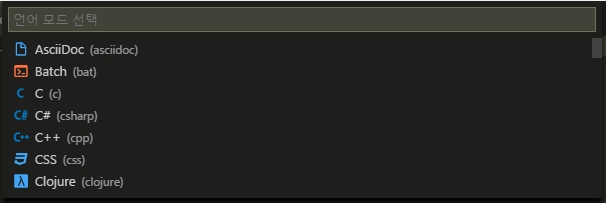

### 테마변경

기본적으로 제공하는 테마를 단축키로 빠르게 선택할 수 있습니다.

단축키: `ctrl+k, ctrl+t`


또한 파일>기본설정>색 테마 로 선택할 수도 있습니다.


### 파일아이콘테마

기본적으로 파일의 아이콘을 표시하지만 확장기능을 통해 직관적으로 파일의 아이콘을 보여줍니다.

`파일>기본설정>파일 아이콘 테마` 를 통해서 적용할 수 있습니다.

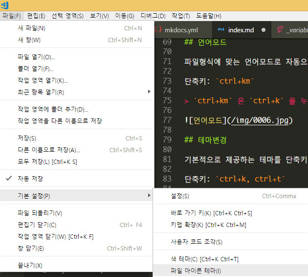

[Material Icon Theme](https://marketplace.visualstudio.com/items?itemName=PKief.material-icon-theme) 를 설치한 후 적용한 아이콘테마의 모습입니다.


### 단축키

기본 단축키는 `ctrl+k, ctrl+s` 를 통해 열람할 수 있습니다.

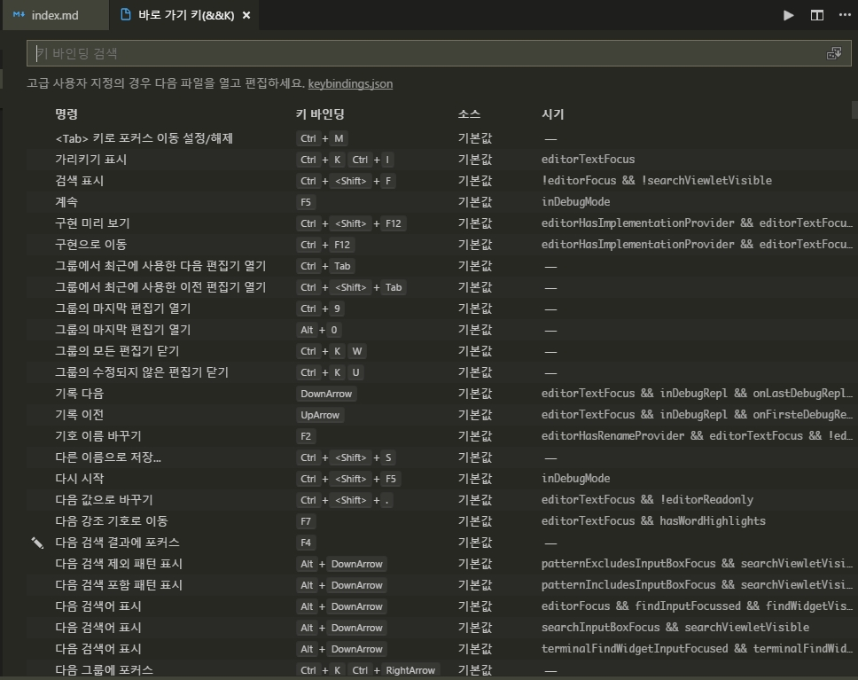

단추키를 사용자정의 할때는 `keybindings.json` 파일을 통해 지정할 수 있습니다.

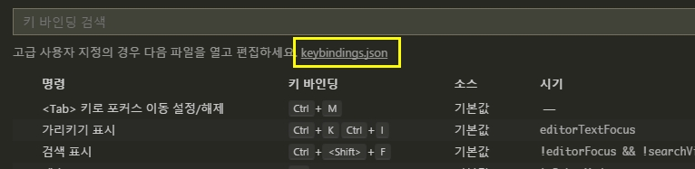

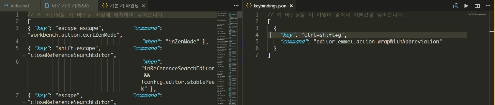

## 기본설정

vscode 의 모든 설정은 `파일>기본설정>설정`에 지정되어 있습니다.

단축키: `ctrl+,`

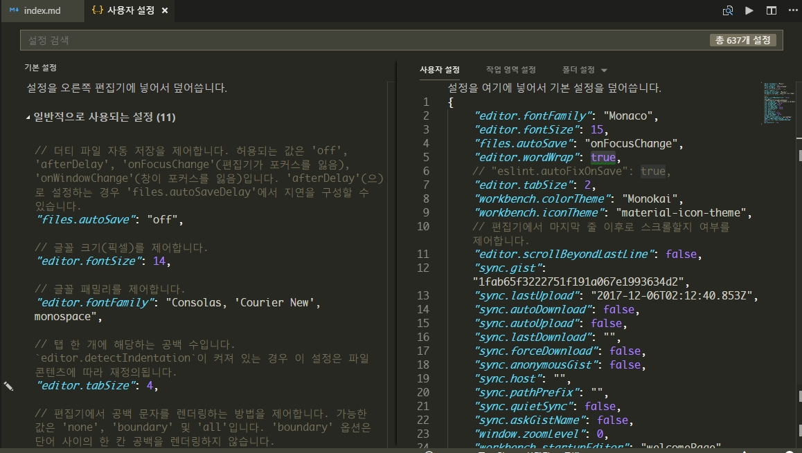

왼쪽의 기본설정을 복사해서 오른쪽의 사용자설정에 붙여넣고 수정해서 사용합니다.  
또는 왼쪽의 기본설정에 연필 아이콘을 클릭하면 편집을 통해 수정하면 오른쪽에 자동 입력되어 집니다.

## 확장프로그램

에디터의 기본 기능보다 더 많은 기능을 마켓 플레이스에서 다운로드해서 사용할 수 있습니다.

단축키: `ctrl+shift+x`

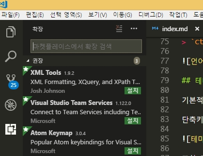

vscode 는 확장프로그램을 좀더 효율적으로 관리하기 위해 설치된 확장만 표시, 모든 확장 표시, 사용할 수 없는 확장 표시 등등...다양한 메뉴를 제공하고 있습니다.


## 터미널

vscode 는 하단에 터미널을 통해 명령을 실행할 수도 있습니다.  `보기>통합터미널` 로 열 수 있습니다.

단축키: ``ctrl+` ``


## 사이드바 전환

에디터의 사이드바를 열고 닫습니다.

단축키: `ctrl+b`


## 젠모드


단축키: `ctrl+k, z`


## 나란히편집

에디터를 둘 또는 셋으로 나란이 놓고 사용할 수 있습니다.

단축키: `ctrl+\`


에디터간 전환은 `ctrl+1`, `ctrl+2`, `ctrl+3` 등으로 할 수 있으며, `ctrl+w` 누르면 탭이 닫힙니다.


## 다중커서

커서를 여러개 만들어서 한번에 작업을 할 수 있습니다.

단축키: `ctrl+alt+up` , `ctrl+alt+down`

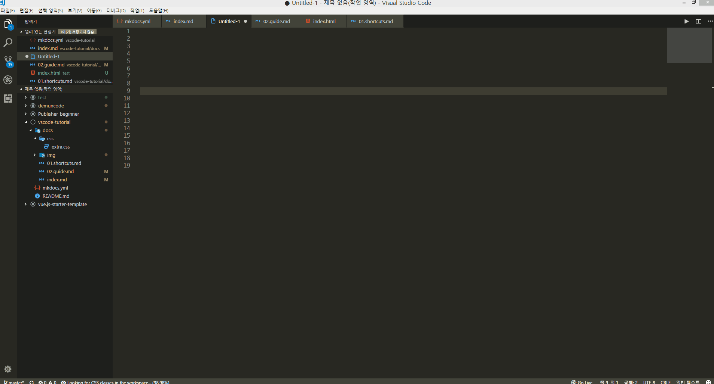

## 행 복사

단축키: `shift+alt+up` , `shift+alt+down`


## 코드접기/펴기

단축키: `ctrl+shfit+[` , `ctrl+shfit+]`


## 마크다운 미리보기

단축키: `ctrl+shfit+v`

또한 옆에서 미리보기를 하면서 수정까지 실시간으로 반영되게 할 수도 있습니다.

단축키: `ctrl+kv`


## 스니펫

vscode 는 기본적인 스니펫을 지원합니다. 또한 언어별로 확장기능을 통해 더 많은 스니펫을 지원합니다.

언어마다 필요한 스니펫은 [마켓플레이스](https://marketplace.visualstudio.com/vscode) 에서 다운로드해서 사용할 수 있습니다.

나만의 스니펫도 만들수 있습니다.

파일 > 기본설정 > 사용자 코드 조각을 누릅니다.

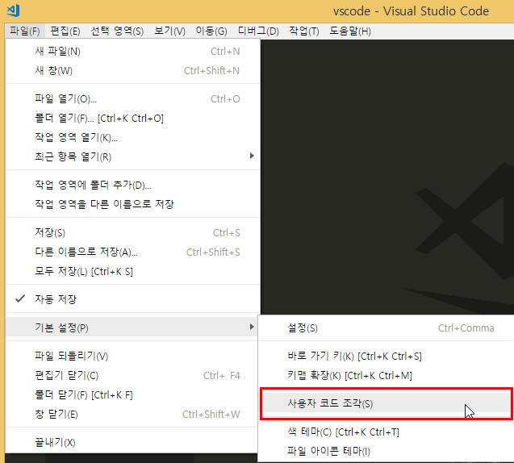

자바스크립트에서 사용할 스니펫을 작성해보겠습니다.


javascript 를 입력하면 아래처럼 해당 파일이 선언됩니다.


아래처럼 구문을 작성해보세요. 예제로 `console.log` 의 구문입니다.


- `console_log` : 아이디처럼 스니펫의 고유 이름입니다.
- `prefix` : 코드힌트에 나나타는 키워드입니다.
- `body` : 코드 부분입니다.
- `description` : 스니펫의 설명입니다.
- `$1` 은 커서가 있는 곳입니다. `$2` 는 두번째 커서가 머무는 곳입니다.

`.js` 파일을 만들고 `con` 이라고 입력해봅니다.

아래처럼 코드힌트로 스니펫이 나타나고 탭을 누릅니다.


스니펫이 입력되어지고 자세히 보시면 첫번째 커서가 머무는 곳이 보입니다. 작성후 탭을 누르면 두번째 위치에 커서가 이동합니다.


스니펫을 추가할 수도 있습니다.

아래처럼 `jquery의 ready` 구문을 입력해보겠습니다.

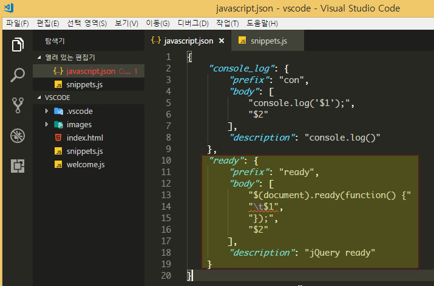

`,` 를 통해 다음 구문을 입력할 수 있고, `\t` 를 입력하면 탭 한개만큼 들여쓰기 합니다.

`ready` 를 입력하니 코드힌트가 나타납니다.

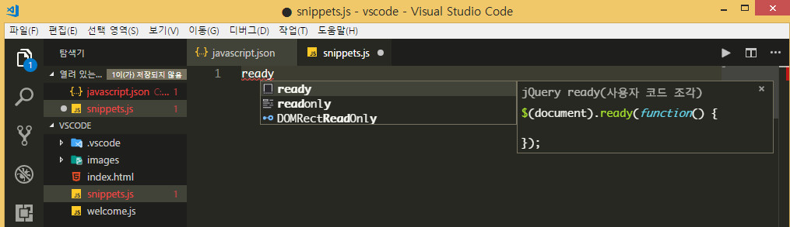

스니펫에서 본것처럼 커서 위치가 지정된채로 나타납니다.


스니펫의 더 많은 정보는 [https://code.visualstudio.com/docs/editor/userdefinedsnippets](https://code.visualstudio.com/docs/editor/userdefinedsnippets) 에서 볼 수 있습니다.


## emmet

vscode 에서는 기본적으로 `emmet` 확장기능을 지원합니다.

젠코딩을 하면 툴팁으로 어떻게 보여지는 미리보기를 통해 보여져서 코딩하기 정말 좋습니다.


emmet 은 기본적으로 활성화되어 있어 바로 사용가능하지만 혹시 활성화가 안된다면 설정에 아래구문을 확인하면 됩니다.

```json
"emmet.triggerExpansionOnTab": true
```

<br>
