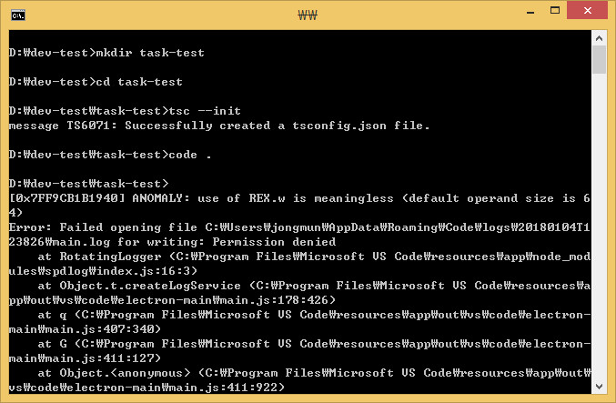
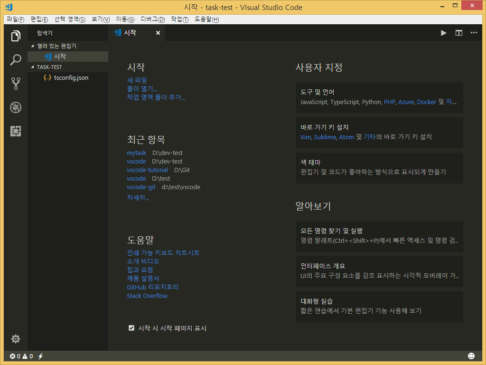
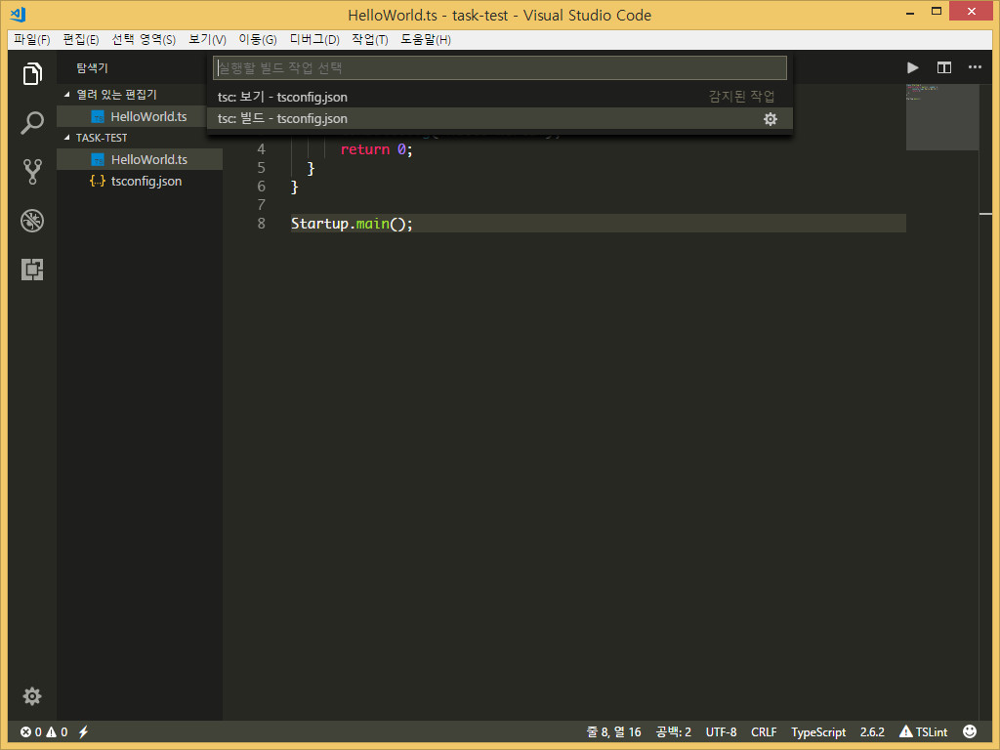
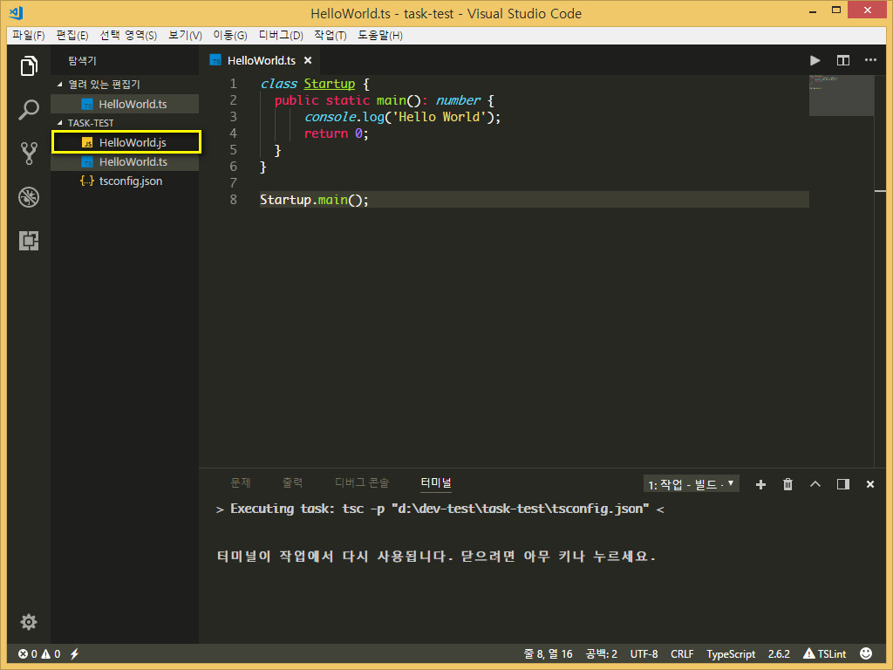
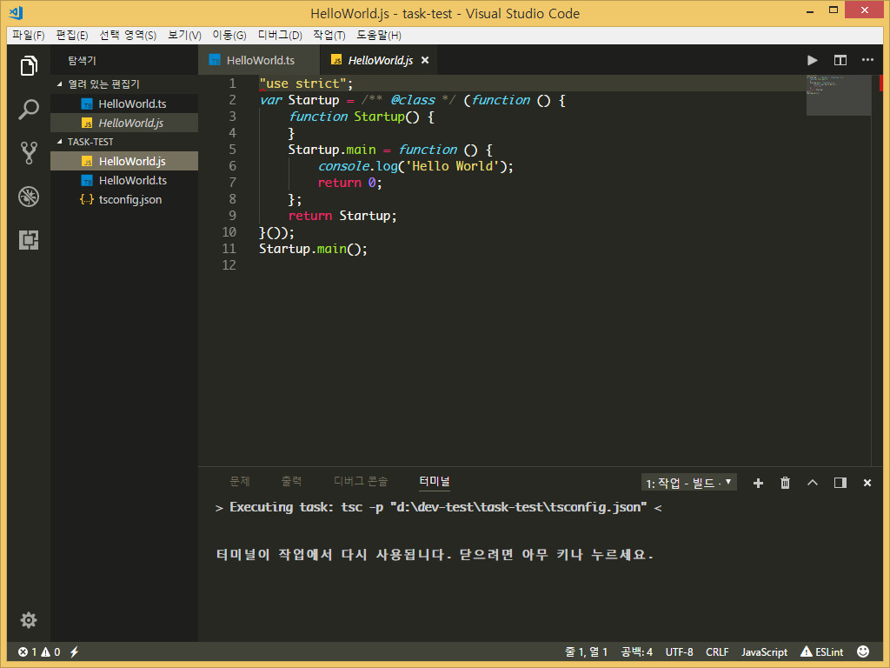
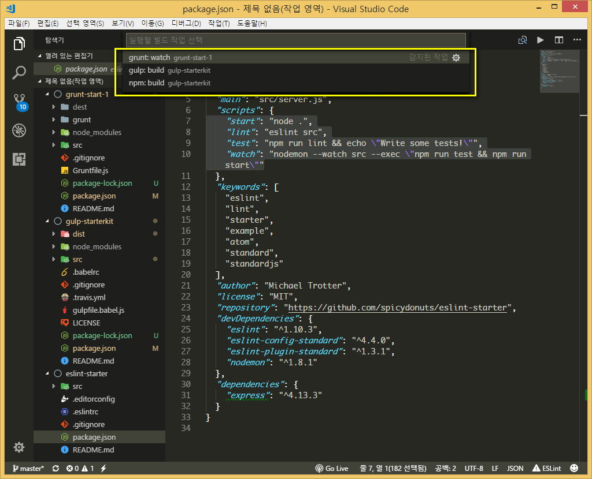
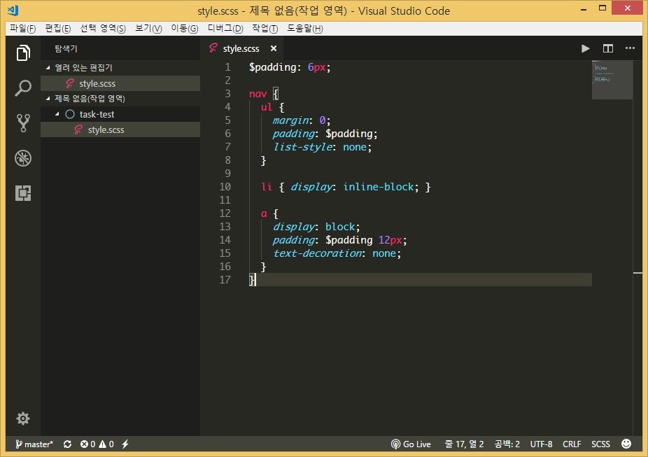
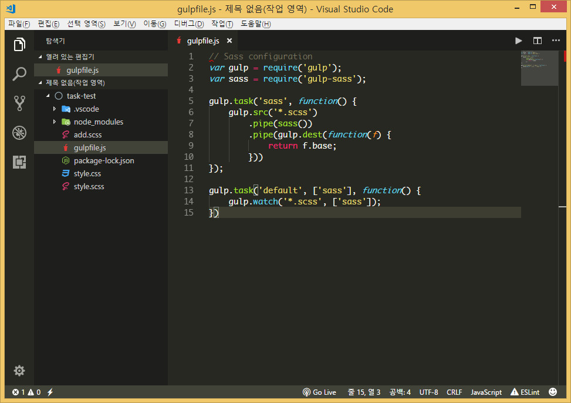
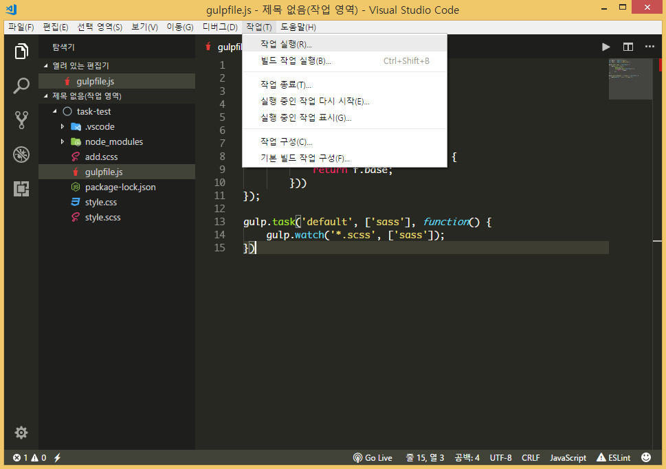

# task

테스크는 grunt, gulp 등과 같은 작업주자 또는 빌드도구를 말합니다. 

vscode 에서는 빌드도구를 에디터 자체내에서 이용할 수 있도록 지원합니다.


## 타입스크립트 빌드하기

타입스크립트는 빌드과정을 거쳐 자바스크립트로 변환해야 사용할 수 있습니다. 따로 빌드도구를 사용하지 않고 vscode 에서 빌드하는 과정을 알려드립니다.

콘솔창에서 아래와 같이 입력합니다.

```sh
mkdir task-test  # task-test 폴더생성
cd task-test     # task-test 폴더로 이동
tsc --init       # tsconfig.json 생성
code .           # vscode 열기
```

코드 실행 모습



vscode 열린 모습



이제 `HelloWorld.ts` 파일을 새로 만듭니다.

구문은 아래와 같이 작성해둡니다.

```ts
class Startup {
    public static main(): number {
        console.log('Hello World');
        return 0;
    }
}

Startup.main();
```

이제 빌드를 해봅니다.  빌드단축키는 `ctrl+shift+b` 입니다.

`tsc 빌드` 를 선택합니다.



빌드가 되어 `HelloWorld.js` 파일이 생성된것이 보입니다. 



`HelloWorld.js` 를 열어보면 빌드가 되서 자바스립트 구문으로 된것이 보입니다.




## 작업 자동 감지
vscode 는 작업주자를 자동으로 감지하고 실행할 수 있습니다.

아래처럼 작업주자가 있어도 `ctrl+shift+b` 를 클릭하면 작업주자가 나옵니다.




## sass 파일 컴파일하기

`sass` 파일을 컴파일하여 `css` 파일로 만들수 있습니다.

먼저 `sass` 파일을 컴파일하려면 [nodejs](https://nodejs.org/) 가 설치되어 있어야하며, `sass` 파일을 컴파일하려면 `node-sass` 를 설치해야합니다.

아래처럼 콘솔창에 입력하세요.

```sh
npm install -g node-sass
```

아래처럼 간단한 `sass` 파일이 있다고 가정 합니다.



빌드 단축키인 `ctrl+shift+b` 를 클릭하면 아래처럼 작업구성이 되어 있지 않다고 나옵니다.

빌드 작업 구성을 클릭합니다.


템플릿에서 tasks.json 파일만들기를 선택합니다.


Others 임의의 외부 명령을 실행하는 예를 선택합니다.


그럼 .vscode 라는 폴더가 생성되고 그 안에 tasks.json 파일이 만들어집니다.


구문을 아래처럼 변경합니다.


환경구성을 했으니 빌드 단축키인 `ctrl+shift+b` 를 누릅니다.


Node Sass Compiler 를 선택합니다.


컴파일이 된 모습이 나타납니다.


`style.css` 파일을 열어보면 컴파일된 모습이 나옵니다.


위에서 명령어인 `node-sass style.scss style.css` 는 `node-sass` 의 명령어입니다.

터미널에서 직접 명령어를 입력해도 동일하게 빌드됩니다.

[node-sass 홈페이지](https://www.npmjs.com/package/node-sass#command-line-interface) 에 보면 각종 옵션이 나와있습니다.


## sass 컴파일 자동화하기

자동화하기 위해서 작업주자인 `gulp` 를 사용해보겠습니다.  그러기위해서는 gulp 와 일부 플러그인을 설치해야합니다.

```sh
npm install -g gulp # 위의 과정을 거쳤다면 안해도 됩니다.
npm install gulp gulp-sass # 현재 폴더 위치에서 실행합니다.
```

`gulpfile.js` 를 만들고 아래와 같이 작성합니다.



```javascript
// Sass configuration
var gulp = require('gulp');
var sass = require('gulp-sass');

gulp.task('sass', function() {
    gulp.src('*.scss')
        .pipe(sass())
        .pipe(gulp.dest(function(f) {
            return f.base;
        }))
});

gulp.task('default', ['sass'], function() {
    gulp.watch('*.scss', ['sass']);
})
```

여기선 간단히 말하면 `gulp.task('sass, ...` 은 작업이름이 `sass` 이고, `gulp.task('default, [sass], ...` 은 작업이름이 `default` 입니다. 

```javascript
gulp.task('default', ['sass'], function() {
    gulp.watch('*.scss', ['sass']);
})
```

에서 `gulp.watch()` 는 실시간으로 `sass` 파일을 감시하는 구문입니다.

빌드작업의 단축키인 `ctrl+shift+b` 를 클릭하면 아래처럼 `Sass Compile` 가 나옵니다.


작업 - 작업실행을 클릭합니다.



`gulp: default` 를 선택합니다.


`작업 출력을 스캔하지 않고 계속`을 선택합니다.


작업이 실행되는 모습이 보입니다.


위에서 언급했던 실시간 감지기능을 알아보기 위해 vscode 에서 두 파일을 열었습니다.


`sass` 파일을 수정하면 `css` 파일도 같이 수정이 되는것을 볼 수 있습니다.


자바스크립트, SASS, LESS, Markdown, TypeScript .... 등등 컴파일하는 방법은 홈페이지를 참고하길 바랍니다.

[https://code.visualstudio.com/docs/languages/overview](https://code.visualstudio.com/docs/languages/overview)

<br>