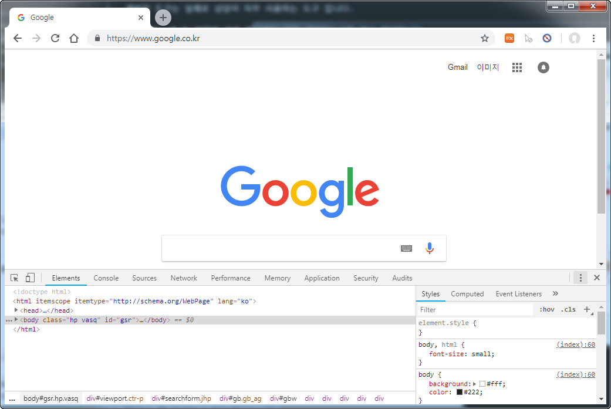

# 개발자 도구 실제 속성값 확인

개발자 도구는 실제로 상당이 자주 사용하는 도구 입니다.

글자크기, 색 등 정확한 값을 확인해야 할때 개발자도구를 열고 확인합니다.

브라우저마다 약간씩은 다르긴하나 많은 부분이 비슷합니다. 여기서는 크롬 개발자도구를 가지고 예를들어 보겠습니다.

크롬에서 F12를 누르면 개발자 도구가 나옵니다.

또는 `Ctrl+Shift+I` 단축키를 눌러도되고, 웹페이지에서 마우스 우측버튼을 눌러 메뉴에서 `검사`를 눌러도 됩니다.

개발자도구 우측에 더보기를 눌러 레이아웃을 변경할 수도 있습니다.

오른쪽 아이콘 모양을 눌러 레이아웃을 변경해보겠습니다.

개발자 도구가 오른쪽에 위치한 경우입니다.

### 요소 스타일 확인하기

인스펙터를 클릭한후 해당 요소를 클릭하면 해당 요소의 정보가 나옵니다.

마우스를 갖다대면 해당 요소가 하이라이트 됩니다.

클릭하면 해당요소의 정보를 볼 수 있습니다.

개발자 도구를 사용하면 현재 배치되어있는 html 구조, 클래스, 아이디 등등의 정보를 알 수 있고, CSS와 같은 정보도 손쉽게 눈으로 확인할 수 있습니다.
이 외에 더 많은 정보를 개발자 도구에서 확인 할 수 있습니다.

