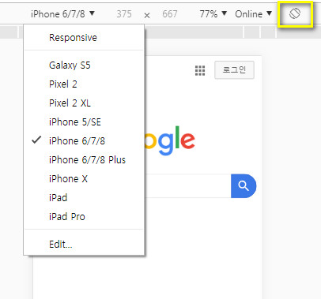

# 모바일 웹페이지 검수

다양한 디바이스의 너비에 맞춘 스타일을 검수할때가 있습니다.

크롬의 개발자도구를 이용하면 모바일기기부터 PC까지 모두 볼 수 있습니다.

개발자 도구를 엽니다 F12.

메뉴중에 두번째에 있는 Toggle device toolbar 를 클릭합니다.

그럼 모바일 너비의 화면으로 웹페이지를 볼 수 있습니다.

브라우져의 옵션만 변경한거기때문에 웹페이지가 바로 반영이 안됩니다. 새로고침을 누르면 반응형페이지인 경우 맞게 보여집니다.

왼쪽에 옵션부분에 각 디바이스에 맞게 지정할 수 있습니다.

우측에 표시한 버튼을 누르면 디바이스의 가로 세로를 볼 수 있습니다.

사용법은 똑같이 인스펙터를 눌러서 해당요소를 클릭해서 모바일에서는 어떤식으로 보이는지 알 수 있습니다.